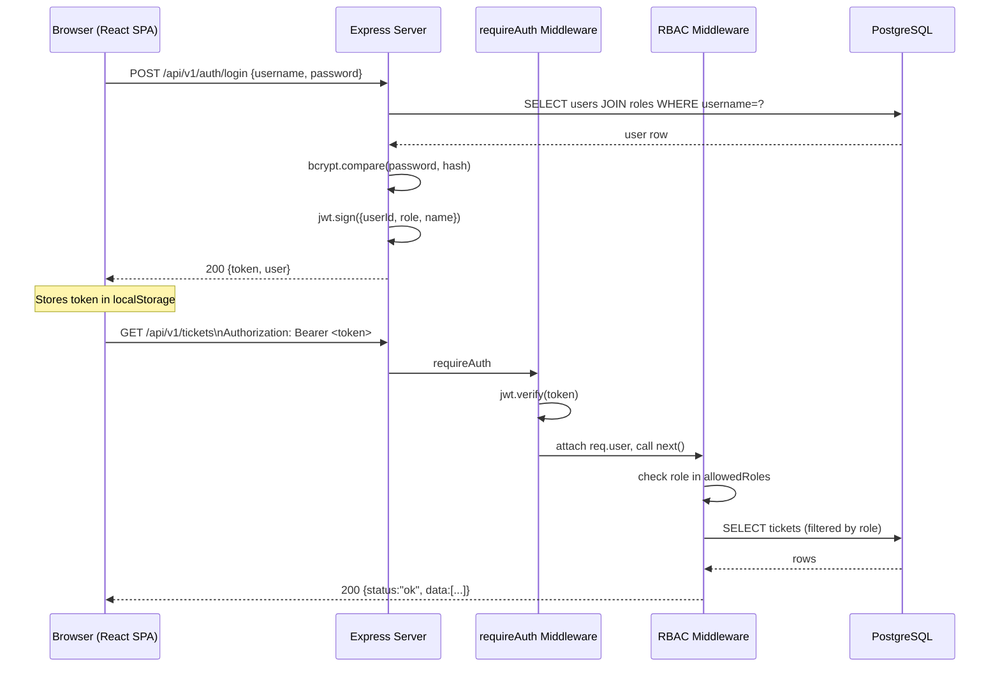

# System Architecture
# ISP Management System — Omnichannel Dashboard

**Version:** 1.0.0  
**Date:** July 2026  

---

## 1. High-Level Overview

The system is a monorepo containing both the React SPA frontend and the Node.js API backend, served from a single Express process in development. In production, the frontend is compiled to static assets and served by the same Express server (or a reverse proxy).

```
┌─────────────────────────────────────────────────────────────┐
│                      Client Browser                         │
│                   React SPA (Vite build)                    │
└────────────────────────┬────────────────────────────────────┘
                         │ HTTP/JSON (Axios)
                         │ Authorization: Bearer <JWT>
                         ▼
┌─────────────────────────────────────────────────────────────┐
│                 Node.js / Express Server                    │
│                      (server.ts)                            │
│                                                             │
│   ┌─────────────┐   ┌──────────────────────────────────┐   │
│   │  Static SPA │   │         REST API v1               │   │
│   │  /dist/*    │   │     /api/v1/*                     │   │
│   └─────────────┘   │                                   │   │
│                      │  /auth     /tickets              │   │
│                      │  /users    /logs                  │   │
│                      │  /settings                        │   │
│                      └──────────────┬───────────────────┘   │
│                                     │                        │
│   ┌─────────────────────────────────▼───────────────────┐   │
│   │              database.js (pg Pool)                  │   │
│   │          PostgreSQL Connection Pool                 │   │
│   │              min:2  max:10                          │   │
│   └─────────────────────────────────┬───────────────────┘   │
└─────────────────────────────────────┼─────────────────────-─┘
                                      │ SQL / TCP
                                      ▼
┌─────────────────────────────────────────────────────────────┐
│                PostgreSQL 13+ Database                      │
│    roles │ users │ tickets │ ticket_technicians             │
│    settings │ logs                                          │
└─────────────────────────────────────────────────────────────┘
```

---

## 2. Component Breakdown

### 2.1 Frontend (React SPA)

| Component | Technology | Notes |
|---|---|---|
| Framework | React 19 | Concurrent mode, hooks-based |
| Build tool | Vite 6 | Hot module replacement in dev |
| Styling | Tailwind CSS v4 | Utility-first, Inter font |
| HTTP client | Axios | With request/response interceptors |
| Icons | lucide-react | Tree-shaken SVG icons |
| Animations | motion (Framer Motion v12) | Status transition animations |
| Maps | react-leaflet + Leaflet | Customer location display |
| Date formatting | date-fns | Locale-aware timestamps |
| Type safety | TypeScript 5.8 strict | Full strict mode enabled |

**Dev server proxy:** In development, Vite proxies `/api/*` and `/uploads/*` to `localhost:3001` (the Express server), eliminating CORS issues without any browser config.

### 2.2 Backend (Node.js API)

| Component | Technology | Notes |
|---|---|---|
| Runtime | Node.js (ESM) | `"type": "module"` in package.json |
| Framework | Express 4 | Lightweight, well-supported |
| Dev runner | tsx | TypeScript execution without compile step |
| Auth | jsonwebtoken (JWT HS256) | Stateless, no session store |
| Passwords | bcrypt | (Production — migration used plain text) |
| File uploads | multer v2 | Disk storage, 10 MB limit |
| DB driver | pg (node-postgres) | Connection pool |
| WhatsApp | whatsapp-web.js | Browser-based WA Web automation |
| AI | @google/genai | Google Gemini integration (planned) |

**Entry point:** `server.ts` — registers Express middleware, mounts `api/v1/index.ts`, serves static files, and initializes the WhatsApp client.

### 2.3 Database

PostgreSQL 13+ with the following design principles:
- `BIGINT` primary keys sourced from JavaScript `Date.now()` timestamps (preserves legacy IDs from JSON migration)
- `TIMESTAMPTZ` for all timestamps (timezone-aware, stored as UTC)
- `CHECK` constraints replace MySQL `ENUM` types
- `set_updated_at()` trigger function keeps `updated_at` accurate automatically
- Foreign key constraints with `ON DELETE CASCADE` where appropriate
- Indexes on all frequently-filtered columns (`status`, `type`, `created_at`, `role_id`)

---

## 3. API Structure

**Base URL:** `/api/v1`

| Router | Mount Path | Auth Required |
|---|---|---|
| Health | `GET /api/v1/health` | No |
| Auth | `/api/v1/auth` | No (login), Yes (me) |
| Tickets | `/api/v1/tickets` | Yes (all routes) |
| Users | `/api/v1/users` | Yes (admin/superuser) |
| Logs | `/api/v1/logs` | Yes (supervisor+) |
| Settings | `/api/v1/settings` | Yes (admin+) |

**Standard response envelope:**
```json
{
  "status": "ok" | "error",
  "data": { ... } | [ ... ],
  "message": "Human-readable string (on error)"
}
```

---

## 4. Authentication & Authorization Flow

### 4.1 Login Flow

```
Client                        Express /api/v1/auth/login
  │                                      │
  │── POST { username, password } ──────►│
  │                                      │── SELECT user + role FROM db
  │                                      │── bcrypt.compare(password, hash)
  │                                      │── jwt.sign({ userId, username, role, name })
  │◄─ 200 { token, user } ─────────────-│
  │                                      │
  │ (stores token in localStorage)       │
```

### 4.2 Authenticated Request Flow

```
Client                    requireAuth           requireRole/Min        Route Handler
  │                           │                      │                     │
  │── GET /api/v1/tickets ───►│                      │                     │
  │  Authorization: Bearer T  │                      │                     │
  │                           │── jwt.verify(T) ──►  │                     │
  │                           │   decode payload      │                     │
  │                           │   attach req.user     │                     │
  │                           │──────────────────────►│                     │
  │                           │                       │ check role in       │
  │                           │                       │ allowedRoles[]      │
  │                           │                       │ or ROLE_LEVELS map  │
  │                           │                       │────────────────────►│
  │                           │                       │                     │ query db
  │◄──────────────────────────────────────────────────────────────── 200 ───│
```

### 4.3 JWT Payload Structure

```typescript
interface JwtPayload {
  userId:   string;   // user.id as string
  username: string;   // user.username
  role:     string;   // one of: vendor | technician | supervisor | admin | superuser
  name:     string;   // user.name (display name)
  iat?:     number;   // issued at (set by jsonwebtoken)
  exp?:     number;   // expiry (set by jsonwebtoken)
}
```

**Token placement:** `Authorization: Bearer <token>` header (not cookies).  
**Expiry:** Configurable via `JWT_EXPIRES` env var, default `8h`.  
**Secret:** `JWT_SECRET` env var, minimum 32 chars, 64 recommended.

### 4.4 RBAC Middleware

Two middleware functions are available:

**`requireRole(allowedRoles: string[])`** — Explicit whitelist:
```typescript
// Only admin and superuser can delete users
router.delete("/:id", requireAuth, requireRole(["admin", "superuser"]), handler);
```

**`requireMinRole(minRole: string)`** — Hierarchy-based:
```typescript
// Technician level and above (technician, supervisor, admin, superuser)
router.get("/", requireAuth, requireMinRole("technician"), handler);
```

**Role hierarchy (ascending privilege):**
```
vendor(1) < technician(2) < supervisor(3) < admin(4) < superuser(5)
```

---

## 5. File Upload Architecture

```
POST /api/v1/tickets (multipart/form-data)
         │
         ▼
   multer middleware
   (disk storage)
         │
         ▼
  /uploads/tickets/
  ├── <timestamp>-<originalname>   (ticket attachment)
  └── reports/
      └── <timestamp>-<originalname>  (completion report)
         │
         ▼
  URL stored in tickets.attachment_url
  Served statically at /uploads/* by Express
```

Media retention: configurable `media_retention_days` in `settings` table (default 60 days). A scheduled cleanup job deletes files older than the threshold.

---

## 6. WhatsApp Integration Architecture

```
Express server.ts
       │
       │ initializes on startup
       ▼
whatsapp-web.js Client
       │
       ├── "qr" event ──► broadcasts QR via SSE/API
       ├── "ready" event ──► marks WA as connected
       └── "disconnected" ──► auto-reinit after 10s
       │
       ▼
  waClient.sendMessage(chatId, text)
       │
       ├── ticket create ──► send to technician phones + group
       └── ticket close  ──► send to technician phones + group
```

---

## 7. Mermaid.js System Flow Diagram



```mermaid
graph TD
    subgraph "Frontend (Vite / React)"
        A[App.tsx] --> B[Auth Context]
        A --> C[Protected Route]
        C --> D[Dashboard / Tickets]
        C --> E[Users]
        C --> F[Settings]
        C --> G[Logs]
    end

    subgraph "Backend (Express)"
        H[server.ts] --> I[/api/v1/auth]
        H --> J[/api/v1/tickets]
        H --> K[/api/v1/users]
        H --> L[/api/v1/logs]
        H --> M2[/api/v1/settings]
        H --> N[Static /uploads]
    end

    subgraph "Data Layer"
        O[(PostgreSQL)]
        P[/uploads/ files]
    end

    D -- "Axios + JWT" --> J
    E -- "Axios + JWT" --> K
    F -- "Axios + JWT" --> M2
    G -- "Axios + JWT" --> L
    J --> O
    K --> O
    L --> O
    M2 --> O
    J --> P
```

---

## 8. Environment Variables Reference

| Variable | Required | Default | Description |
|---|---|---|---|
| `DB_HOST` | Yes | `localhost` | PostgreSQL host |
| `DB_PORT` | No | `5432` | PostgreSQL port |
| `DB_NAME` | Yes | — | Database name |
| `DB_USER` | Yes | — | DB username |
| `DB_PASSWORD` | Yes | — | DB password |
| `DB_POOL_MIN` | No | `2` | Pool minimum connections |
| `DB_POOL_MAX` | No | `10` | Pool maximum connections |
| `JWT_SECRET` | Yes | (insecure default) | JWT signing secret (min 32 chars) |
| `JWT_EXPIRES` | No | `8h` | JWT token lifetime |
| `PORT` | No | `3001` | Express listen port |
| `NODE_ENV` | No | `development` | `development` or `production` |
| `VITE_API_BASE` | No | `` | Frontend API base URL |

---

## 9. Deployment Architecture (Target)

```
Internet
    │
    ▼
[Nginx / Reverse Proxy]
    │
    ├── /* ──────────► /dist (static React SPA)
    └── /api/*  ─────► Node.js :3001 (Express)
    └── /uploads/* ──► /var/app/uploads (file storage)
         │
         ▼
    PostgreSQL :5432
```

- **Staging:** Single VPS, both Node.js and PostgreSQL on the same host.
- **Production:** Separate database server (managed PostgreSQL preferred), Node.js behind Nginx, SSL via Let's Encrypt.