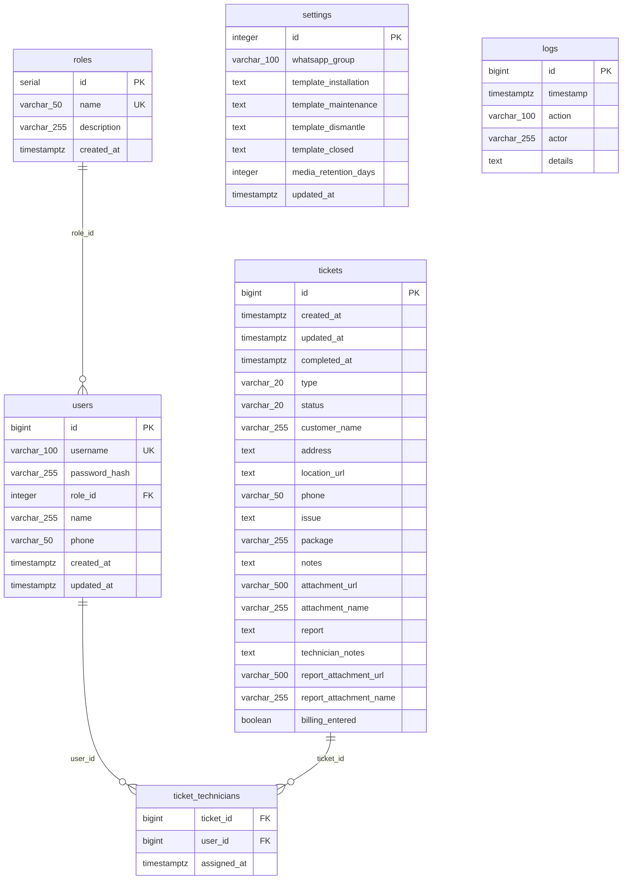

# Database Schema Documentation
# ISP Management System — PostgreSQL

**Version:** 1.0.0  
**Date:** July 2026  
**Database:** PostgreSQL 13+  
**Schema file:** `schema.sql`  

---

## 1. Overview

The database uses **6 tables** to model the ISP ticketing system. All timestamps are stored as `TIMESTAMPTZ` (UTC). Primary keys on `users`, `tickets`, and `logs` use `BIGINT` IDs generated by JavaScript's `Date.now()` — this preserved the original IDs when migrating from the JSON flat-file database.

**Tables:**
1. `roles` — RBAC role definitions
2. `users` — System users with role FK
3. `tickets` — Core service ticket records
4. `ticket_technicians` — Many-to-many: tickets ↔ assigned users
5. `settings` — Singleton application configuration
6. `logs` — Append-only audit trail

**Shared trigger function:** `set_updated_at()` — automatically sets `updated_at = NOW()` on every `UPDATE` operation.

---

## 2. Data Dictionary

### 2.1 Table: `roles`

Stores all supported RBAC roles. Seeded with 5 fixed rows at schema creation.

| Column | Type | Constraints | Description |
|---|---|---|---|
| `id` | `SERIAL` | PK, NOT NULL | Auto-increment integer |
| `name` | `VARCHAR(50)` | UNIQUE, NOT NULL | Role slug (e.g. `admin`, `technician`) |
| `description` | `VARCHAR(255)` | NOT NULL, DEFAULT `''` | Human-readable description |
| `created_at` | `TIMESTAMPTZ` | NOT NULL, DEFAULT `NOW()` | Row creation timestamp |

**Seeded rows:**

| id | name | description |
|---|---|---|
| 1 | `admin` | Admin / CS – manages tickets and users |
| 2 | `technician` | Field technician – handles assigned tickets |
| 3 | `vendor` | Vendor / external contractor – handles assigned tickets |
| 4 | `supervisor` | Supervisor / NOC – monitors all activity |
| 5 | `superuser` | Super-user – full system access |

---

### 2.2 Table: `users`

All system users. Passwords must be stored as bcrypt hashes in production.

| Column | Type | Constraints | Description |
|---|---|---|---|
| `id` | `BIGINT` | PK, NOT NULL | `Date.now()` timestamp ID (from JSON migration) |
| `username` | `VARCHAR(100)` | UNIQUE, NOT NULL | Login username |
| `password_hash` | `VARCHAR(255)` | NOT NULL | bcrypt hash of the password |
| `role_id` | `INTEGER` | NOT NULL, FK → `roles.id` | User's RBAC role |
| `name` | `VARCHAR(255)` | NOT NULL | Display name (full name) |
| `phone` | `VARCHAR(50)` | NULL | WhatsApp-compatible phone number |
| `created_at` | `TIMESTAMPTZ` | NOT NULL, DEFAULT `NOW()` | Account creation time |
| `updated_at` | `TIMESTAMPTZ` | NOT NULL, DEFAULT `NOW()` | Last update (auto-managed by trigger) |

**Foreign Keys:**
- `fk_users_role`: `role_id` → `roles(id)` ON UPDATE CASCADE

**Indexes:**
- `idx_users_role_id` on `role_id`
- `idx_users_username` on `username`

**Trigger:** `trg_users_updated_at` — calls `set_updated_at()` before each UPDATE.

---

### 2.3 Table: `tickets`

The core business entity. Represents one field service job (installation, maintenance, or dismantle). Technician assignment is managed by the `ticket_technicians` junction table.

| Column | Type | Constraints | Description |
|---|---|---|---|
| `id` | `BIGINT` | PK, NOT NULL | `Date.now()` timestamp ID |
| `created_at` | `TIMESTAMPTZ` | NOT NULL, DEFAULT `NOW()` | Ticket creation time |
| `updated_at` | `TIMESTAMPTZ` | NOT NULL, DEFAULT `NOW()` | Last modification (auto-trigger) |
| `completed_at` | `TIMESTAMPTZ` | NULL | Timestamp when ticket was closed |
| `type` | `VARCHAR(20)` | NOT NULL, CHECK | `installation` \| `maintenance` \| `dismantle` |
| `status` | `VARCHAR(20)` | NOT NULL, DEFAULT `open`, CHECK | `open` \| `in-progress` \| `completed` \| `cancelled` |
| `customer_name` | `VARCHAR(255)` | NOT NULL, DEFAULT `''` | Customer's full name |
| `address` | `TEXT` | NOT NULL, DEFAULT `''` | Installation/service address |
| `location_url` | `TEXT` | NULL | Google Maps or shortened location URL |
| `phone` | `VARCHAR(50)` | NOT NULL, DEFAULT `''` | Customer contact number |
| `issue` | `TEXT` | NULL | Problem description (maintenance/dismantle only) |
| `package` | `VARCHAR(255)` | NULL | Internet package name (installation only) |
| `notes` | `TEXT` | NULL | Internal notes by admin |
| `attachment_url` | `VARCHAR(500)` | NULL | Path to uploaded evidence file |
| `attachment_name` | `VARCHAR(255)` | NULL | Original filename of attachment |
| `report` | `TEXT` | NULL | Technician's closing report text |
| `technician_notes` | `TEXT` | NULL | Technician's internal notes (not shared) |
| `report_attachment_url` | `VARCHAR(500)` | NULL | Path to completion photo |
| `report_attachment_name` | `VARCHAR(255)` | NULL | Original filename of completion photo |
| `billing_entered` | `BOOLEAN` | NOT NULL, DEFAULT `FALSE` | Flag: billing record entered in billing system |

**CHECK Constraints:**
```sql
CHECK (type   IN ('installation', 'maintenance', 'dismantle'))
CHECK (status IN ('open', 'in-progress', 'completed', 'cancelled'))
```

**Indexes:**
- `idx_tickets_status` on `status`
- `idx_tickets_type` on `type`
- `idx_tickets_created_at` on `created_at`

**Trigger:** `trg_tickets_updated_at` — calls `set_updated_at()` before each UPDATE.

---

### 2.4 Table: `ticket_technicians`

Junction/bridge table resolving the many-to-many relationship between `tickets` and `users`. A single ticket can be assigned to multiple technicians or vendors simultaneously.

| Column | Type | Constraints | Description |
|---|---|---|---|
| `ticket_id` | `BIGINT` | PK (composite), FK → `tickets.id` | References the ticket |
| `user_id` | `BIGINT` | PK (composite), FK → `users.id` | References the assigned user |
| `assigned_at` | `TIMESTAMPTZ` | NOT NULL, DEFAULT `NOW()` | When the assignment was made |

**Primary Key:** Composite `(ticket_id, user_id)` — prevents duplicate assignments.

**Foreign Keys:**
- `fk_tt_ticket`: `ticket_id` → `tickets(id)` ON DELETE CASCADE ON UPDATE CASCADE
- `fk_tt_user`: `user_id` → `users(id)` ON DELETE CASCADE ON UPDATE CASCADE

**Cascade behaviour:** When a ticket or user is deleted, their assignment rows are automatically removed.

**Indexes:**
- `idx_tt_user_id` on `user_id`
- `idx_tt_ticket_id` on `ticket_id`

---

### 2.5 Table: `settings`

Singleton configuration table. Always contains exactly one row (`id = 1`), enforced by a CHECK constraint.

| Column | Type | Constraints | Description |
|---|---|---|---|
| `id` | `INTEGER` | PK, DEFAULT `1`, CHECK (`id = 1`) | Always 1 — singleton pattern |
| `whatsapp_group` | `VARCHAR(100)` | NULL | WhatsApp group chat ID for notifications |
| `template_installation` | `TEXT` | NOT NULL, DEFAULT `''` | WA message template for new installation tickets |
| `template_maintenance` | `TEXT` | NOT NULL, DEFAULT `''` | WA message template for maintenance tickets |
| `template_dismantle` | `TEXT` | NOT NULL, DEFAULT `''` | WA message template for dismantle tickets |
| `template_closed` | `TEXT` | NOT NULL, DEFAULT `''` | WA message template on ticket closure |
| `media_retention_days` | `INTEGER` | NOT NULL, DEFAULT `60` | Days before uploaded media files are auto-deleted |
| `updated_at` | `TIMESTAMPTZ` | NOT NULL, DEFAULT `NOW()` | Last settings update (auto-trigger) |

**Trigger:** `trg_settings_updated_at` — calls `set_updated_at()` before each UPDATE.

**Usage pattern:** Always use `INSERT ... ON CONFLICT (id) DO UPDATE` (upsert) to write settings.

---

### 2.6 Table: `logs`

Append-only audit trail. Never updated — only inserted and read. Application code trims the table to the most recent 500 rows after each insert.

| Column | Type | Constraints | Description |
|---|---|---|---|
| `id` | `BIGINT` | PK, NOT NULL | `Date.now()` timestamp ID |
| `timestamp` | `TIMESTAMPTZ` | NOT NULL, DEFAULT `NOW()` | When the event occurred |
| `action` | `VARCHAR(100)` | NOT NULL | Event type (e.g. `TICKET_CREATE`, `USER_LOGIN`) |
| `actor` | `VARCHAR(255)` | NOT NULL, DEFAULT `'System'` | Username or `'System'` for automated actions |
| `details` | `TEXT` | NOT NULL, DEFAULT `''` | Human-readable event description |

**Indexes:**
- `idx_logs_timestamp` on `timestamp DESC` (most-recent-first queries)
- `idx_logs_action` on `action`

---

## 3. RBAC Permission Matrix

Enforced in the application layer (middleware), not in the database.

| Capability | `superuser` | `admin` | `supervisor` | `technician` | `vendor` |
|---|:---:|:---:|:---:|:---:|:---:|
| View ALL tickets | ✅ | ✅ | ✅ | ❌ | ❌ |
| View own + open tickets | ✅ | ✅ | ✅ | ✅ | ✅ |
| Create tickets | ✅ | ✅ | ❌ | ❌ | ❌ |
| Edit any ticket | ✅ | ✅ | ❌ | ❌ | ❌ |
| Edit own assigned ticket | ✅ | ✅ | ❌ | ✅ | ✅ |
| Close / complete ticket | ✅ | ✅ | ❌ | ✅ | ✅ |
| Cancel ticket | ✅ | ✅ | ❌ | ❌ | ❌ |
| Manage users (CRUD) | ✅ | ✅ | ❌ | ❌ | ❌ |
| View audit logs | ✅ | ✅ | ✅ | ❌ | ❌ |
| Edit settings | ✅ | ✅ | ❌ | ❌ | ❌ |

---

## 4. Trigger Function

```sql
CREATE OR REPLACE FUNCTION set_updated_at()
RETURNS TRIGGER AS $$
BEGIN
    NEW.updated_at = NOW();
    RETURN NEW;
END;
$$ LANGUAGE plpgsql;
```

Applied via `BEFORE UPDATE` triggers on: `users`, `tickets`, `settings`.

---

## 5. Note on JSONB

The current schema does **not** use `JSONB` columns. All hardware API response data (planned for MikroTik/OLT modules in Phase 2/3) will be stored in JSONB columns in future extension tables, for example:

```sql
-- Planned: Phase 2
CREATE TABLE mikrotik_sessions (
    id          BIGSERIAL PRIMARY KEY,
    ticket_id   BIGINT REFERENCES tickets(id),
    queried_at  TIMESTAMPTZ NOT NULL DEFAULT NOW(),
    raw_data    JSONB NOT NULL   -- full RouterOS API response
);
```

This allows flexible querying of device telemetry (`raw_data->>'rx-bytes'`) without premature schema normalization.

---

## 6. Mermaid.js ER Diagram



---

## 7. Common Queries

### Get all tickets with assigned technicians
```sql
SELECT
    t.*,
    ARRAY_AGG(u.name ORDER BY u.name) FILTER (WHERE u.id IS NOT NULL) AS technician_names
FROM tickets t
LEFT JOIN ticket_technicians tt ON tt.ticket_id = t.id
LEFT JOIN users u ON u.id = tt.user_id
GROUP BY t.id
ORDER BY t.created_at DESC;
```

### Get tickets visible to a technician (assigned + open unassigned)
```sql
SELECT DISTINCT t.*
FROM tickets t
LEFT JOIN ticket_technicians tt ON tt.ticket_id = t.id
WHERE
    (tt.user_id = $1)                         -- assigned to this technician
    OR (t.status = 'open' AND NOT EXISTS (    -- OR open with no assignment
        SELECT 1 FROM ticket_technicians tt2
        WHERE tt2.ticket_id = t.id
    ))
ORDER BY t.created_at DESC;
```

### Upsert settings (singleton pattern)
```sql
INSERT INTO settings (id, whatsapp_group, template_installation, media_retention_days)
VALUES (1, $1, $2, $3)
ON CONFLICT (id) DO UPDATE SET
    whatsapp_group        = EXCLUDED.whatsapp_group,
    template_installation = EXCLUDED.template_installation,
    media_retention_days  = EXCLUDED.media_retention_days;
-- updated_at is handled by trigger
```

### Trim logs to last 500 rows
```sql
DELETE FROM logs
WHERE id NOT IN (
    SELECT id FROM logs ORDER BY timestamp DESC LIMIT 500
);